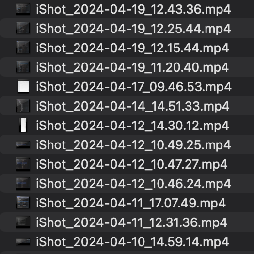
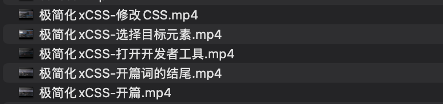
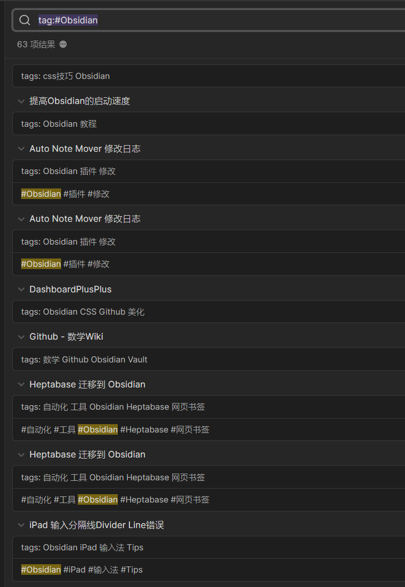

# Siyuan x LifeLog｜（一）关于记笔记这件事

‍

许多人对记笔记这件事存在着一定的误解，以至于我需要用这么一个篇章来开始整个系列。

因为我实在是不希望看到类似“XXX 更重要”、“XXX 不重要”、“XXX 更好”的言论了。

‍

> 极简化：
>
> 1、写笔记是因为人脑健脑
>
> 2、笔记的核心需求：【记】和【看】
>

> 3、笔记的衍生需求：提高笔记的检索效率
>
> 4、信息是有关联性的
>
> ‍
>
> 我希望别人写的东西能节省我的时间，所以我写东西也希望不浪费别人的时间。
>
> 以上是本文主旨，如果你觉得你理解的没问题，你可以关闭本篇文章。
>
> 如果你对任何小节内容有不确定的想法、或者想听听我的看法，欢迎继续阅读。

‍

首先，让我们来看看，

## 1、为什么我们要记笔记

之所以我们需要写【笔记】这么一个玩意，纯粹是由于【人脑健忘】。

我们需要把脑子里的想法落到实处，因此，我们需要需要用“笔”，将脑子里的想法写到“纸”上。

也就成了用笔记写下的记录——笔记。

‍

这跟本文的主旨有什么关系呢？

因为这涉及到

## 2、笔记的核心需求——“记”和“看”

因为怕忘记，所以需要写下来，以便于之后在我们需要的时候，可以回看。

这就是【记笔记】这件事【最本质的需求】。

‍

但是在这个年代，笔记系统这个东西，已经发展的足够久了。

加上只要是写过一段时间笔记的人，最后都会面临一个问题：

> 随着笔记数量的增加，从众多记录中找到自己需要的内容，其难度也会随之增加。

‍

因此记笔记这件事出现了，

## 3、衍生需求——提高检索效率

无论你使用哪种方式整理你的笔记，本质上都是为了减少无关内容的干扰，将“注意力”放在”你想要的内容上”，减少精力上的消耗，提高效率。

像文件夹、标签、分组这些功能，都是为了提高效率所采用的一种方式。

‍

实际上，包括【命名】、【命名规则】也都是提高效率的方式之一。

像下面这几个文件，你能区分他们是做什么的吗？

对于这些文件的创建者——我本人来说，除了知道这些是使用 iShot(开头的软件名) 这个软件创建的录屏(mp4后缀)文件以外，完全不知道它们的内容讲了什么。

我需要进一步预览各个视频的内容，甚至整个视频，才能完整的回想起这个视频当初是出于什么原因录制的。

​​

‍

而同样使用 iShot 录制的视频，下面这些我看一眼，就知道是当初制作极简化 x CSS 教学视频时，所录制的片段。

如果这些视频不需要再为我所用，根据标题名称我可以选择忽视，甚至进一步删除这些视频。

​​

‍

如果我们跳出具体名词，进入更抽象的宏观视角。

前面提到的“文件夹”其实约等同于“笔记本”。

一个简单的场景。

你可以将语文、数学、英语笔记，分别写在一个单独的“笔记本”中。

当你明天只有数学课时，你的书包里只需要放入数学课本和数学笔记本，语文和英语这两科的东西，你完全可以丢在家里。

而在数字化的世界（也就是你的电脑、手机、平板里），你可以为语文、数学、英语分别创建一个文件夹，用来存放相关的笔记内容。

​​

‍

我想只要用过电子化的方式写笔记的人，应该都不会采用文件夹的方式，而是一个科目对应一篇“文档”。

甚至更进一步，采用 All in one 的方式，使用“分区”来组织笔记内容。

‍

下图就是我以前使用 All in one 写下的一些记录。

上面三块区域，下面五块区域，分别对应着八块不同的内容。

​​

‍

提到了分区，这个时候我们又不得不说一下“标签”。

当你对笔记内容需要组织时，如果你使用“文件夹”的方式，那么一篇关于思源笔记的 CSS 教程，你是放到【思源笔记】这个文件夹？还是【CSS】这个文件夹？

为了解决这个问题，常用的就是“标签”体系。

好比群友阿菜的笔记，使用了“Obsidian”这样的标签，将多个内容“标记”成跟 Obsidian 是有关的。

通过检索标签，就能将相关内容汇聚于一处。

​​

‍

以上是在电子化的场景。

在纸质笔记里，由于笔记是写在“纸”上的，纸又是装订在“本子”里的。

为了方便快速的找到某条内容，我曾经采用的是下图这样贴标签的方式。

​​

‍

根据颜色，我能知道内容的重要性。

顺着标签，我就能快速从众多内容中定位到某条笔记。

​​

‍

你应该也能发现，

* 这些颜色代表的含义是什么？
* 同样的“橙色标签”代表的又是什么意思？

其实我跟你是一样的。

上面的本子，是我近十年前写下的内容，十年后的我再看到他们，我完全不记得它们所代表的含义是什么了。

‍

到这里，我们可以顺势谈论笔记的下一个内容，

## **4、笔记的结构，或者说信息的关联性**

前面说到的语文、数学、英语分科目制作笔记本，群友阿菜使用标签做标记。

**其目的都是为了表明一段信息，跟另一段是有关联的。** 

‍

即便是采用文件夹、笔记本等任意方式，在你采用这种方式时，就已经对信息进行了分类。也就已经表明这里面的内容（信息），与某个主题（信息）是有关联的。

哪怕其中的另一段信息，只是 [[语文]]、[[数学]]、[[英语]]、[[Obsidian]] 这样简单的 [[主题]] 词汇。

而正是由于这种关联性，导致笔记产生了众多的形态。

也因此，整个系列的第二篇，将会从笔记的形态进行展开。

‍

碍于我不想把这篇文章写得既啰嗦又特别长，虽然还有很多的具体案例，但我就不继续在这里赘述了。

整个系列，我写出来的内容是一部分，作为读者的你们，根据内容所产生的想法和交流，也属于整个系列的一部分。

如果看完你有任何想要交流的，欢迎在评论区提出，或[通过这里直接联系我](https://simplest-frontend.feishu.cn/wiki/wikcnHmIs4HagSlJPiti2VESQEh#H5N9dK061o6R4sxUWTiccgvYnAc)。

‍

写到这里，希望我已经把

1. 写笔记的目的是防止遗忘
2. 无论怎样的方式，都是为了提高检索效率
3. 信息的关联性决定了笔记的形态

这些想法给传达出去了。

‍
